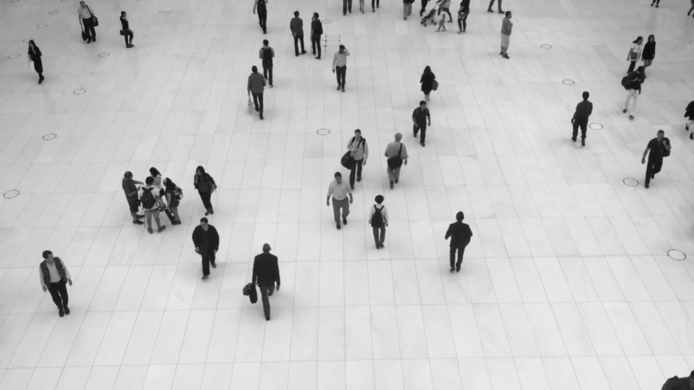
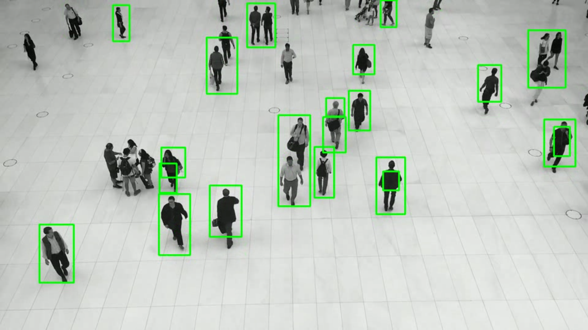

# Motion Detector

Simple **OpenCV** code to detect objects in motion in video streams.
The processed video is saved as an avi video file.

The code is meant for processing video files, but with some minor changes, it can be used to detect moving objects in live video streams also.

---

**A still for original video:**

---

**Still from Processed Video:**

